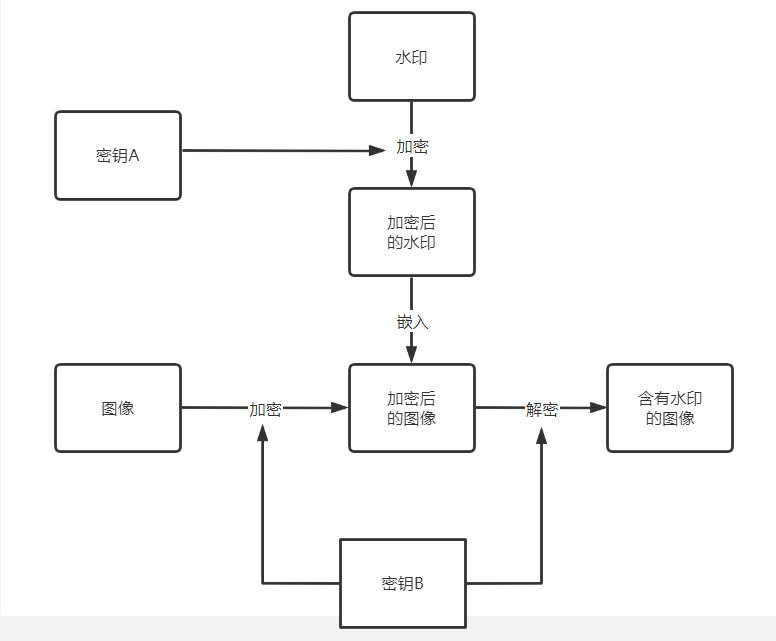
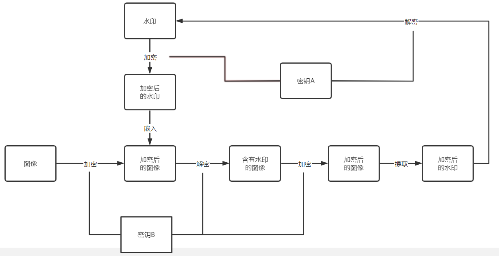

# 数字水印

> 使用Java实现了一种基于加密域的数字水印算法

## 😎项目介绍

基于Spring Boot实现的数字水印系统，实现了图片的上传和查看，数字水印的嵌入和提取

特色：

- 使用异步编程来完成水印处理的任务（提高了水印的处理效率）
- 使用Websocket来进行消息推送（替换了轮询的方式，减少了资源的消耗）
- 使用密码来保护水印（用户无需记住复杂的密钥）
- 水印是盲水印（嵌入的水印不可见，并且提取水印时，只需要提供密码和带有水印的图像，不需要提供原始图像和水印图像）

主要技术：

| 技术         | 版本  | 官网                                                         |
| ------------ | ----- | ------------------------------------------------------------ |
| Spring Boot  | 2.6.6 | [https://spring.io/projects/spring-boot](https://spring.io/projects/spring-boot) |
| MyBatis-Plus | 3.5.1 | [https://baomidou.com/](https://baomidou.com/)               |

效果展示：

<table>
    <tr>
        <td>
            
        </td>
        <td>
            
        </td>
    </tr>
</table>

前端界面请移步：[https://github.com/lyh2048/small-tools](https://github.com/lyh2048/small-tools)

## 😎水印嵌入

水印使用二值图像，水印的嵌入在加密域进行，嵌入位置随机选择3-5位，具体的嵌入流程如下图所示

## 😎水印提取

水印提取在图像的加密域进行，提取出的水印需要进行解密，具体的流程如下图所示

## 😎参考文献

[1]梅时春,李人厚,刘芳,党红梅.一种加密域数字图像水印方法[J].计算机工程与设计,2004(02):216-219.DOI:10.16208/j.issn1000-7024.2004.02.017.

[2]贾淑芸,黄荣怀,温孝东,叶卫平.基于置乱和混沌加密的数字图像水印技术研究[J].北京师范大学学报(自然科学版),2005(02):146-149.
